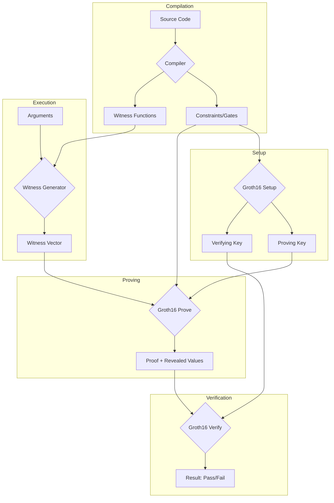

# QAPy

A QAP (Quadratic Arithmetic Program) compiler implemented in Python, used to compile programs written in a Python-like domain-specific language into QAP form, and perform setup, proof, and verification steps of the [Groth16](https://eprint.iacr.org/2016/260.pdf) zero-knowledge proof system.

## Features

- Python-like DSL for writing arithmetic circuits
- Complete Groth16 zk-SNARK implementation (setup, prove, verify)
- Support for binary operations (AND, XOR, shifts, rotations)
- Built-in support for permutation networks (Waksman network)
- FFT-based polynomial operations for efficient proof generation
- Parallel computation support for cryptographic operations

## Requirements

- Python 3.9+
- [pymcl](https://github.com/Jemtaly/pymcl) - BN254 pairing-based cryptography library
- dill - Extended pickling support

## Installation

```bash
git clone https://github.com/Jemtaly/QAPy
cd QAPy
pip install -e .
```

Run the test suite to verify the installation:

```bash
qapy-test
```

## Architecture



### Core Components

| Component | File | Description |
| --------- | ---- | ----------- |
| **Types** | `types.py` | Defines core types: `Var` (circuit variables), `Witness`, `Gate` |
| **Circuit** | `circuit.py` | Provides primitives for building arithmetic circuits (gates, wires, assertions) |
| **Compiler** | `compiler.py` | Parses the DSL and compiles source code into arithmetic circuits |
| **Groth16** | `groth16.py` | Implements the Groth16 zk-SNARK protocol (setup, prove, verify) |

## CLI Reference

QAPy provides a command-line interface with four subcommands: `compile`, `setup`, `prove`, and `verify`.

### Compile

Compile source code and optionally export constraints, witness functions, and public entry names.

```text
usage: qapy compile [-h] [-g GATES] [-f FUNCS] [-n NAMES] file

positional arguments:
  file                  path to the source code

options:
  -h, --help            show this help message and exit
  -g, --gates GATES     path to write the constraints to (skipped if not given)
  -f, --funcs FUNCS     path to write the witness generation functions to (skipped if not given)
  -n, --names NAMES     path to write the public entry names to (skipped if not given)
```

### Setup

Generate proving and verifying keys. Can read constraints from a compiled file or directly from source code.

```text
usage: qapy setup [-h] [-g GATES] [-p PK] [-v VK] [file]

positional arguments:
  file                  path to the source code (optional)

options:
  -h, --help            show this help message and exit
  -g, --gates GATES     path to read the constraints from (required if source code is not given)
  -p, --pk PK           path to write the proving key to (default: a.pk)
  -v, --vk VK           path to write the verifying key to (default: a.vk)
```

### Prove

Generate a zero-knowledge proof. Accepts program arguments as key=value pairs.

```text
usage: qapy prove [-h] [-g GATES] [-f FUNCS] [-p PK] [-a [ARGS ...]] [-P PROOF] [file]

positional arguments:
  file                  path to the source code (optional)

options:
  -h, --help            show this help message and exit
  -g, --gates GATES     path to read the constraints from (required if source code is not given)
  -f, --funcs FUNCS     path to read the witness generation functions from (required if source code is not given)
  -p, --pk PK           path to read the proving key from (default: a.pk)
  -a, --args [ARGS ...] the arguments to the program as key=value pairs
  -P, --proof PROOF     path to write the proof to (default: a.proof)
```

### Verify

Verify a proof and display public values if verification passes.

```text
usage: qapy verify [-h] [-n NAMES] [-v VK] [-P PROOF] [file]

positional arguments:
  file                  path to the source code (optional)

options:
  -h, --help            show this help message and exit
  -n, --names NAMES     path to read the public entry names from (required if source code is not given)
  -v, --vk VK           path to read the verifying key from (default: a.vk)
  -P, --proof PROOF     path to read the proof from (default: a.proof)
```

## Usage Examples

Several example programs are provided in the `examples/` directory:

| Example | Description |
| ------- | ----------- |
| `sha256.qapy` | SHA-256 compression function (single block) |
| `sm3.qapy` | SM3 hash compression function |
| `rc4.qapy` | RC4 stream cipher |
| `sort.qapy` | Sorting verification circuit |
| `sodoku.qapy` | Sudoku puzzle verification |

### Example: SHA-256 Proof

**Method 1: With Pre-compilation** (recommended for repeated proofs with same circuit)

```bash
# Step 1: Compile the program
qapy compile examples/sha256.qapy -g sha256.gates -f sha256.funcs -n sha256.names

# Step 2: Setup (generate proving and verifying keys)
qapy setup -g sha256.gates -p sha256.pk -v sha256.vk

# Step 3: Generate a proof (input: padded message "abc")
qapy prove -g sha256.gates -f sha256.funcs -p sha256.pk -P sha256.proof -a \
    W[0]=0x61626380 W[1]=0 W[2]=0 W[3]=0 W[4]=0 W[5]=0 W[6]=0 W[7]=0 \
    W[8]=0 W[9]=0 W[10]=0 W[11]=0 W[12]=0 W[13]=0 W[14]=0 W[15]=24

# Step 4: Verify the proof
qapy verify -n sha256.names -v sha256.vk -P sha256.proof
```

**Method 2: Direct Mode** (compiles on-the-fly, convenient for development)

```bash
# Setup
qapy setup examples/sha256.qapy -p sha256.pk -v sha256.vk

# Prove
qapy prove examples/sha256.qapy -p sha256.pk -P sha256.proof -a \
    W[0]=0x61626380 W[1]=0 W[2]=0 W[3]=0 W[4]=0 W[5]=0 W[6]=0 W[7]=0 \
    W[8]=0 W[9]=0 W[10]=0 W[11]=0 W[12]=0 W[13]=0 W[14]=0 W[15]=24

# Verify
qapy verify examples/sha256.qapy -v sha256.vk -P sha256.proof
```

### Argument Format

Arguments are passed as `key=value` pairs where:

- `key` is the parameter name defined in the source code via `secret()` or `public()`
- `value` can be decimal (e.g., `123`) or hexadecimal (e.g., `0x7B`)

## DSL Overview

QAPy uses a Python-like domain-specific language for defining arithmetic circuits.

### Basic Types and Operations

```python
# Define secret and public inputs
x = b32(secret('x'))      # 32-bit secret input (binary representation)
y = b32(public('y'))      # 32-bit public input (binary representation)
z = secret('z')           # Field element (scalar) secret input
w = public('w')           # Field element (scalar) public input

# Binary operations (on binary values)
a = x ^ y                 # XOR
b = x & y                 # AND
c = x | y                 # OR
d = ~x                    # NOT (bitwise inversion)
e = x >> 3                # Right shift (by constant)
f = x << 5                # Left shift (by constant)
r = x >> 7 | x << 25      # Rotation (ROR)

# Arithmetic on binary values
sum = x + y               # Addition (returns truncated result)
diff = x - y              # Subtraction
prod = x * y              # Multiplication (returns lower bits)

# Arithmetic on field elements
s = z + w                 # Field addition
t = z - w                 # Field subtraction
u = z * w                 # Field multiplication
v = z / w                 # Field division (multiplicative inverse)

# Reveal outputs (makes them public)
reveal('result', x)
```

### Control Flow

**Important**: Control flow conditions must evaluate to **compile-time constants**. You cannot branch on secret witness values directly.

#### Loops (Compile-time)

```python
# For loop - iteration count must be known at compile time
for i in range(16):
    W[i] = b32(secret(fmt('W[{}]', i)))

# Iterating over lists (index, value pairs)
for i, v in L:
    process(i, v)

# While loop - condition must be a compile-time constant
i = 0
while i < 10:
    # loop body
    i = i + 1
```

#### If Statement (Compile-time)

```python
# The condition must be a constant at compile time
n = 10
if n > 5:
    x = b32(secret('x'))
else:
    x = b64(secret('x'))

# This will NOT work - condition depends on witness value:
# if x > y:  # Error: x and y are circuit variables
#     ...
```

#### Conditional Expression (Runtime)

Use the ternary expression for runtime conditionals on witness values:

```python
x = b32(secret('x'))
y = b32(secret('y'))
cond = x > y              # Returns a circuit variable (0 or 1)

# This works! Creates a circuit that selects based on cond
result = a if cond else b
```

The ternary expression `a if cond else b` compiles to a circuit that computes `cond * a + (1 - cond) * b`, allowing selection based on witness values.

### Functions

Functions work similarly to Python, with lexical scoping:

```python
# Function definition
def MAJ(x, y, z):
    t = x & y
    return [t[i] + z[i] * (x[i] + y[i] - t[i] * 2) for i in range(32)]

# Lambda expressions
ROR = lambda x, r: x >> r | x << 32 - r

# Function calls
result = MAJ(a, b, c)
rotated = ROR(x, 7)
```

### With Block (Witness Computation)

The `with` block in QAPy has completely different semantics from Python. It defines a **witness computation context** for computing non-deterministic values that will be verified by the circuit.

```python
with (input1, input2, ...) as output1[n], output2[m][k], ...:
    # Witness computation body
    # Runs at witness generation time, not during proving
    return (result1, result2, ...)
```

**Key characteristics:**

1. **Separate execution context**: The body runs in an isolated `Program` context during witness generation
2. **Inputs**: Variables listed before `as` are passed into the context (their concrete values at witness generation time)
3. **Outputs**: Variables after `as` receive the computed results as new witness values with specified dimensions
4. **Runtime arguments**: Use `param('name')` inside the block to access runtime arguments
5. **No constraints generated**: The body doesn't add constraints; it only computes witness values

**Example: Computing modular inverse**

```python
x = b32(secret('x'))
m = b32(0x10001)  # modulus

# Compute inverse in witness generation context
with (x, m) as inv[32]:
    # This runs at witness generation time
    # Can use arbitrary Python-like computation
    x_val = gal(x)  # convert to field element
    m_val = gal(m)
    # Extended Euclidean algorithm or other computation
    return b32(pow(x_val, m_val - 2, m_val))

# Now 'inv' is a 32-bit witness value
# Add your custom constraints to verify: x * inv ≡ 1 (mod m)
```

**Example: Sorting verification**

```python
# Input: unsorted array
A = [b32(secret(fmt('A[{}]', i))) for i in range(n)]

# Compute sorted array in witness context
with (A,) as B[n][32]:
    # Sort using any algorithm - runs at witness generation
    return sorted(A, key=gal)

# B now contains the sorted values
# Add constraints to verify B is a permutation of A
assert_is_perm([gal(a) for a in A], [gal(b) for b in B], "not a permutation")
# Add constraints to verify B is sorted
for i in range(n - 1):
    assert_binle(B[i], B[i + 1], "not sorted")
```

### Built-in Functions

| Function | Description |
| -------- | ----------- |
| `secret(name)` | Declare a secret input parameter |
| `public(name)` | Declare a public input parameter |
| `reveal(name, value)` | Make a value public in the proof |
| `b8/b16/b32/b64(x)` | Convert to 8/16/32/64-bit binary |
| `bin(x, n)` | Convert to n-bit binary |
| `gal(x)` | Convert binary to field element |
| `fmt(s, ...)` | Format string (like Python's `.format()`) |
| `concat(a, b, ...)` | Concatenate lists |
| `repeat(x, n)` | Repeat list n times |
| `range(n)` / `range(a, b)` | Generate range (compile-time) |
| `zip(a, b, ...)` | Zip multiple lists |
| `len(x)` | Get list length (compile-time) |
| `slice(x, i, j)` | Slice list (circular) |
| `reverse(x)` | Reverse list |
| `binadd(x, y, c)` | Binary addition with carry |
| `binsub(x, y, c)` | Binary subtraction with borrow |
| `binmul(x, y, c, d)` | Binary multiplication |
| `divmod(x, y)` | Binary division and modulo |
| `assert_eqz(x, msg)` | Assert x equals zero |
| `assert_nez(x, msg)` | Assert x not zero |
| `assert_is_bool(x, msg)` | Assert x is 0 or 1 |
| `assert_is_perm(a, b, msg)` | Assert b is permutation of a |
| `assert_binle/lt/ge/gt(x, y, msg)` | Assert binary comparisons |

## Disclaimer

This project is for educational and research purposes only. It may contain vulnerabilities and should not be used in production systems without thorough security review. The author is not responsible for any misuse or damages resulting from the use of this software.
